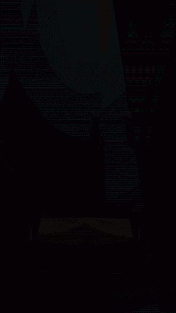

# UnityGameMyTwinInTheOtherUniverse - Unity3D Mobil Oyun Prototipi

## Herkese Selamlar

Bu proje, Unity ile yaptığım bir **3D Hyper-Casual Mobile Game** deneme projem.

Bu projeyi yapmamdaki amaç; Unity ile 3D Mobile oyun yaparken ki süreci planlayıp, runner hyper-casual türüne uygun olabilecek mekanikler deneyerek bütün oyun yapım sürecini deneyimlemekti.

Sonuç olarak kendim tasarlayıp ortaya çıkardığım 5 farklı level'ı olan ve bu levelların sürekli döngü halinde devam ettiği Runner Hyper-Casual türünde bir 3D mobil oyun prototipi ortaya çıkarttım.

## İçindekiler

0. [Herkese Selamlar](#herkese-selamlar)
1. [Uygulama Hakkında](#uygulama-hakkında)
2. [Görsel Açıklama](#gorsel-aciklama)
3. [Youtube Linki](#youtube-linki)

## Uygulama Hakkında

Oyun içerisindeki amaç, platform üzerindeki topları toplayarak hedef tahtasını 3 kere vurmaktır.

Her level içerisinde 2 farklı karakter ile hareket ediyoruz. İlk karakterimiz ile level'ın başında platform üzerindeki topları yerinden çıkartmaya çalışıyoruz. Karakter toplara temas ettiği zaman toplar yukarıya doğru uçuyorlar. İlk platformun sonuna gelindiğinde bir kamera animasyonu ile birlikte 2. karaktere geçiş yapıyoruz. 2. karakterimiz ise bir sepet. Bu karakterin bulunduğu platformda önceki platformda yukarıya çıkarttığımız toplar sürekli olarak zıplıyorlar ve bu karakterimiz ile ilerlerken topları tutmaya çalışıyoruz. Platformun sonuna gelindiğinde yine bir kamera animasyonu ile atış yapılacak noktaya geliniyor ve hedef tahtasından topladığımız topları 3 defa geçirmeye çalışıyoruz.

Toplam 5 farklı level tasarladım. 5. level'a gelindikten sonra oyun tekrar 1. level'a geçer ve devam eder.

## Görsel Açıklama

Ekrana dokunduğumuz zaman karakter ileri doğru ilerler. Parmağımızı sağa-sola sürükleyerek karakterin sağa-sola gidişi sağlanır.

Atış kısmına gelindiğinde ekrana dokunulup parmağımızı sürükleyerek topu fırlatırız. Dokunmaya başladığımız ve bitirdiğimiz yönün x eksenine göre top sağa-sola doğru atılır.

Kamera geçişleri.

Bloklar.

## Youtube Linki

Youtube üzerinden paylaştığım uygulama videosuna [bu linkten](https://youtu.be/RflteJHHRaE) ulaşabilirsiniz.
